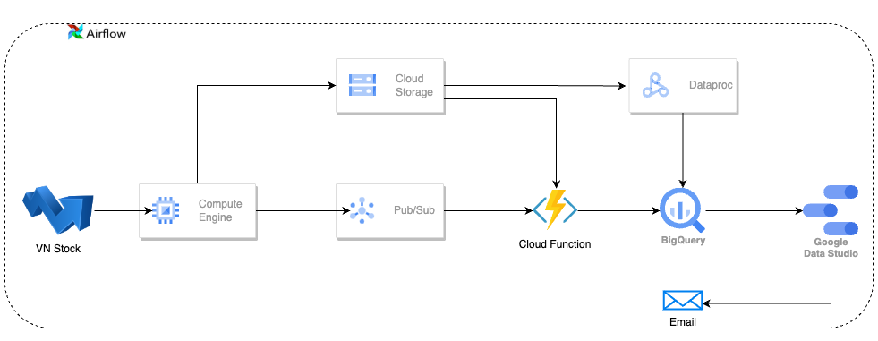
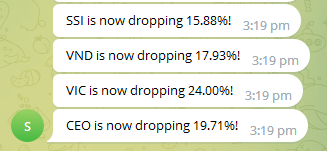

# Source

## Architecture

## 0. Setup
- Set up `Airflow` on Google Cloud VM
- Create `GCS buckets`: `vnstock`, `grown_stock`
- Set up a [Google Cloud connection](src/connection_configurating/cloud_connection.py) for `Airflow`
- Configure `Airflow SMTP` to send alert emails when a task failed
- Create the `vnstock` topic on `Google Pub/Sub`

### 1. Load data to GCS buckets
- Load stock data in the past 1 year to the `vnstock` bucket as `year_data.csv`: [load_year_data.py](src/data_processing/load_year_data.py)
- Daily Airflow data pipeline: [daily_pipeline.py](src/dags/daily_dag.py)
  - Load stock data daily and store each day as individual `CSV` files in the `vnstock` bucket: [load_daily_data.py](src/data_processing/load_data.py)
  - Calculate and select stocks with the most stable growth in the last 3 months and load it to the `growth_stock` bucket by submitting a job to `Dataproc` (Spark): [load_grown_stock.py](src/data_processing/grown_stock.py)
  - Run at 4 PM every weekday (Monday to Friday)
  - Retry 3 times, each time 5 minutes apart
  - Send an alert email when a task failed
- Hourly Airflow data pipeline: [hourly_pipeline.py](src/dags/hourly_dag.py)
  - Load and publish subscribed stock data to the `Google Pub/Sub` `vnstock` topic hourly: [load_subscribe_data.py](src/data_processing/subsribed_stock.py)
  - If any subscribed stock drops over 10% compared to the expected price, send a warning message to `Telegram` via the Telegram bot
  
  - Run hourly from 10 AM to 3 PM every weekday
  - Retry 3 times, each time 5 minutes apart
  - Send an alert email when a task failed

### 2. Load data from GCS buckets to Big Query
- Load `year_data.csv` to the `Big Query` table `stock_data`: [data_sample](data/processed_data/stock_data)
- Create 3 `Cloud Functions`
  - [load_daily_stock](src/cloud_functions/load_daily_stock): When new daily stock data is being uploaded to `vnstock` bucket, append it to the `stock_data` table in `Big Query`. Data sample: [stock_data](data/processed_data/stock_data.csv)
  - [load_subscribe_stock](src/cloud_functions/load_subscribed_stock): When new subscribed stock data is being uploaded to `vnstock` Pub/Sub topic, append it to the `subscribed_stock` table in `Big Query`. Data sample: [subscribed_stock](data/processed_data/subscribed_stock.csv)
  - [load_grown_stock](src/cloud_functions/load_grown_stock): When new stock data is being uploaded to `grown_stock` bucket, write truncate it to `grown_stock` table in `Big Query`. Data sample: [grown_stock](data/processed_data/grown_stock.csv)
 
### 3. Visualize stock performance
- Load data from `Big Query` to `Looker studio` and visualize stock performance

